<p align="center"></p>

# X Files

The only desktop surface that reads the replies to your own X posts and tells
you what they said: classified digests, representative quotes, and a drainable
needs-your-reply queue, for a few dollars a month of API credits with an
always-visible spend meter.

```
                    nothing waiting: the slot collapses
Replies: 3          three replies need you (questions, gripes, feature asks)
Replies: at cap     the monthly spend cap was reached
X Files: setup      run x-files-login to connect your account
```

X Files keeps the file on every reply to your posts, so you read what
matters and skip what does not. It never posts, never DMs, never scores
sentiment, and never reads your whole timeline. It reads the replies to
*your* posts, buckets them, and hands you the ones that actually need an
answer.

## What it does

- **A drainable queue**, not a feed. Questions, gripes, and feature asks with
  real substance, from other people, one per near-duplicate group, sorted
  newest-first. `+1` chains, praise, and spam never reach it. Press `m` to
  clear one, `c` to clear all.
- **Per-post digests.** For each recent post: reply volume and velocity,
  bucket chips (`4 gripes · 2 questions · 1 ask`), and two verbatim quotes
  from the loudest buckets. Buckets and quotes, never a numeric sentiment
  score.
- **A live spend meter, as loud or as quiet as you want.** X API reads are
  pay-per-use, so X Files keeps a running monthly ledger. Nobody wants to
  stare at a dollar figure all day, so how it shows is a setting: **Compact**
  (default) is a small fill bar that tints amber near the cap, no number;
  **Full** shows `$1.83 this month, ~$2.84 projected · cap $8.00`; **On
  alert** stays hidden until you near the cap; **Off** never shows it. The
  exact figure is always one hover away on the pill tooltip, and the hard
  stop works in every mode: the cap is not a warning, and a second
  price-independent read-count ceiling backs it up so a mis-set rate can
  never hide runaway spend.

## The cost story

X API v2 is [pay-per-use credits](https://console.x.com): **$0.005 per post
read**, and just **$0.001 for "owned reads"** of your own data (verified at
`docs.x.com/x-api/getting-started/pricing`, 2026-08-20). X Files keeps
the bill small with `since_id` discipline: every poll asks only for what
arrived since the last one, an empty poll is nearly free, and the
conversation fan-out is gated on a post's reply count actually rising.

A founder with roughly 1,200 replies a month lands around **$6 to $12/month**
(a reply on a tracked post can be read once via the mentions poll and again
via the conversation fan-out, so real fan-out trends above the $6 floor),
versus $40/month for a dumb column reader that refetches everything every
time. The spend meter is the pitch.

Which rate your account bills at, the owned $0.001 or the standard $0.005,
is not knowable until your first live poll, so it is a **setting, not a
baked-in constant**: spend $5, watch the credit console once, set the rate,
and the meter is exact. The parsers and the ledger math are fully covered by
the offline test suite; only that one live billing-class check remains.

## Install and connect

```bash
omarchy plugin add https://github.com/jeremylongshore/omarchy-x-files-entry --enable
```

Then connect your X account. The login command is separate on purpose: the
widget never writes or sees your token, and settings only ever show its last
four characters. So the widget's own prompt ("run x-files-login") is
copy-pasteable, symlink the command onto your PATH once:

```bash
PLUGIN=~/.config/omarchy/plugins/io.github.jeremylongshore.x-files
mkdir -p ~/.local/bin
ln -sf "$PLUGIN/bin/x-files-login" ~/.local/bin/x-files-login
```

Now connect. The token is read from **stdin, never the command line**, so it
never lands in your shell history or a world-readable process list:

```bash
# Get an app-only bearer token and credits at https://console.x.com
printf %s "$YOUR_BEARER_TOKEN" | x-files-login --username <your-x-handle>
# or run it with no pipe and paste the token at the prompt:
x-files-login --username <your-x-handle>
```

Add **X Files** to your bar layout (Omarchy menu, Bar, or
`~/.config/omarchy/shell.json`). The service starts polling every 15 minutes.

To disconnect: `x-files-login --forget`. State lives in
`~/.local/state/omarchy/x-files/` and is safe to delete.

## The panel

Standard Omarchy panel keys:

| Key | Action |
| --- | --- |
| `j` / `k` or arrows | Move the cursor in the queue |
| `Enter` or `o` | Open the reply's thread in your browser |
| `m` or `x` | Mark the selected reply done |
| `c` | Clear the whole queue |
| `r` | Refresh now (no notification) |
| `Esc` | Close |
| `Tab` / `Shift+Tab` | Switch to the neighboring bar panel |

Left-click opens a reply, right-click marks it done. Middle-click the pill to
refresh.

## Optional AI summaries, bring your own key, any provider

Point the three `ai*` settings at **whatever model you already pay for, or a
model running on your own machine**, and each busy post gets a two- or
three-sentence summary above its quotes. This is real BYOK: you bring the
key, X Files does not care whose it is. The one requirement is that the
endpoint speaks the OpenAI chat-completions wire format, which is not an
OpenAI thing, it is the format essentially every provider and every local
runtime exposes. Paste a base URL, a model name, and your key:

| Provider | `aiBaseUrl` | `aiModel` example |
| --- | --- | --- |
| Groq | `https://api.groq.com/openai/v1` | `llama-3.3-70b-versatile` |
| DeepSeek | `https://api.deepseek.com/v1` | `deepseek-chat` |
| Together | `https://api.together.xyz/v1` | `meta-llama/Llama-3.3-70B-Instruct-Turbo` |
| OpenRouter | `https://openrouter.ai/api/v1` | `anthropic/claude-3.7-sonnet` |
| xAI (Grok) | `https://api.x.com/v1` | `grok-4` |
| Anthropic | `https://api.anthropic.com/v1` | `claude-sonnet-4` |
| OpenAI | `https://api.openai.com/v1` | `gpt-4o-mini` |
| **Ollama (local, free)** | `http://localhost:11434/v1` | `llama3.3` |
| **LM Studio (local, free)** | `http://localhost:1234/v1` | your loaded model |

Note the local rows: your key never leaves the machine, and the summaries
cost nothing. (Local `http://` endpoints are the one case exempt from the
https-only rule, and only for `localhost`/loopback.)

Two-pass by design: classification is local and free, and only a post whose
conversation grew is worth a completion. Every quote is PII-stripped (emails,
tokens, keys, phone numbers) before it leaves for the model. Off by default;
the widget is complete without it.

## What it will never do

Auto-reply, auto-DM, follower or viral metrics, full-timeline reading, post
scheduling, numeric sentiment scores, or cloud sync. Those were considered
and rejected: this is a reading tool, not a growth tool.

## Architecture

```
bin/x-files-login   a small bash script: writes credentials.json (0600),
                    the ONLY token writer
Service.qml         the whole poll cycle, in QML, with no external runtime
        |  curl --proto =https, Authorization via stdin (never argv),
        |  since_id on every fetch, spend charged per returned post
        v
~/.local/state/omarchy/x-files/state.json   FileView atomic write, no token
        ^
        |  read + mark-done, synchronously
BarWidget.qml + Panel.qml (render + keys)
```

**No Node.js, no Python, no external runtime.** A stock Omarchy install has no
node on the graphical session PATH (Omarchy installs it through mise, whose
shims are not exported to the session), so this plugin depends on nothing but
Quickshell, `curl`, and `jq` for the one-time login. That is the same pattern
the marketplace-validated MLB Booth and Pit Wall widgets use.

The bearer token rides curl's stdin (`--header @-`) in both the login script
and the QML service, so it never appears in a process argv, and it lives only
in `credentials.json` (mode 0600), never in `state.json` or any log. The panel
never sees it: only the last four characters reach the rendered state. The
service is the single owner of the reply store, so marking a reply done takes
effect immediately rather than round-tripping through a subprocess.

Network hosts: `api.x.com` (GET only), plus your own BYOK completion endpoint
(POST, only if configured). No telemetry, nothing sent anywhere else.

## Testing

```bash
npm test
```

31 tests over the pure data layer: the X API v2 parsers, lane classification,
substance scoring, hybrid dedupe, PII redaction, digest building, the
needs-reply gate, the spend ledger and projection, and the state record.
Offline against synthesized v2 fixtures; the live-capture procedure is in
`docs/FIXTURES.md`.

## License

MIT
